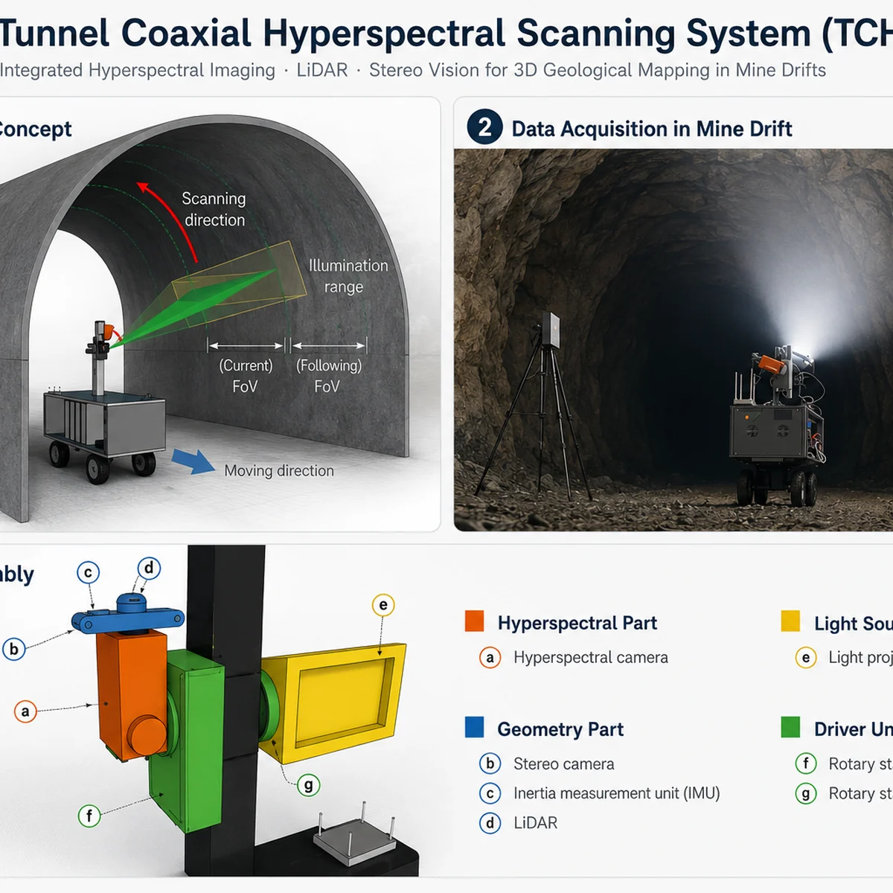
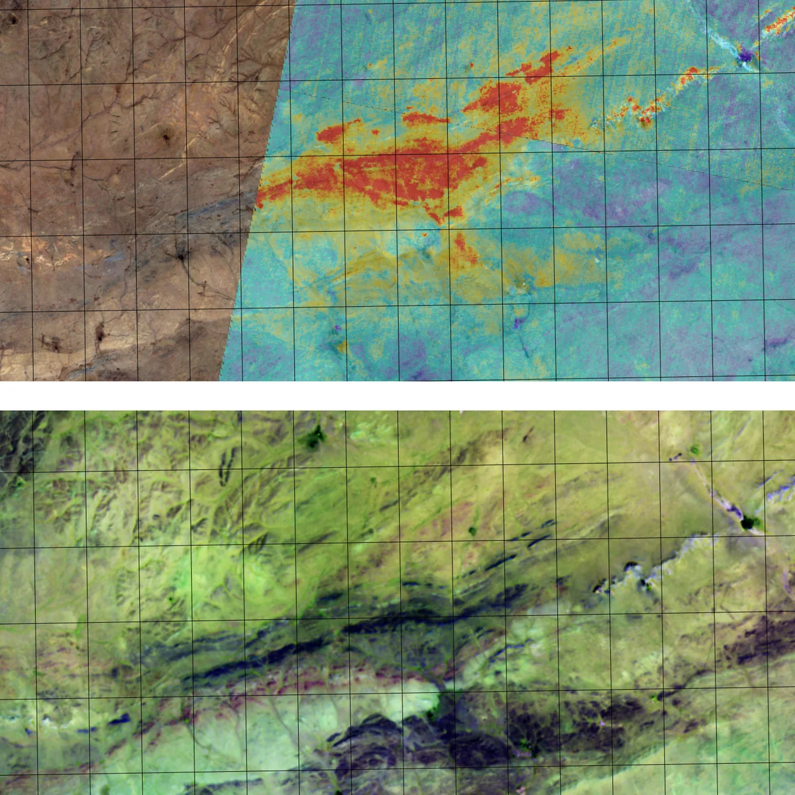
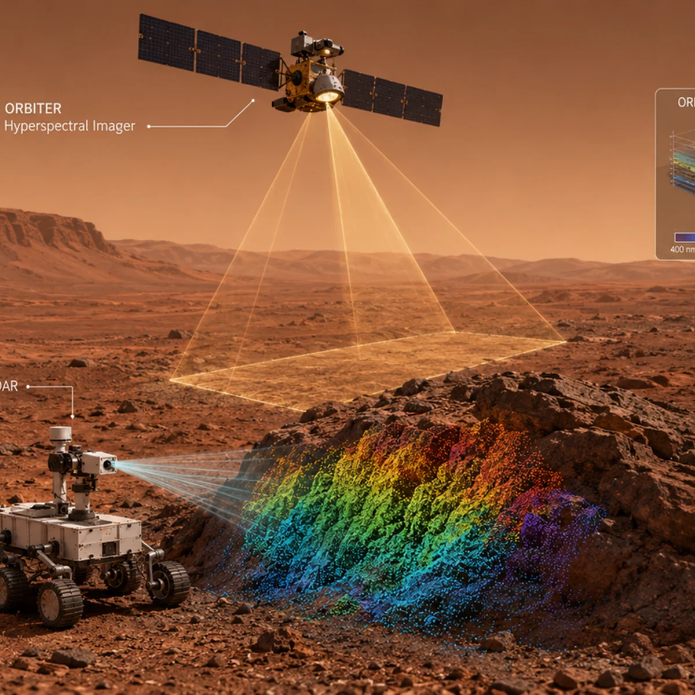
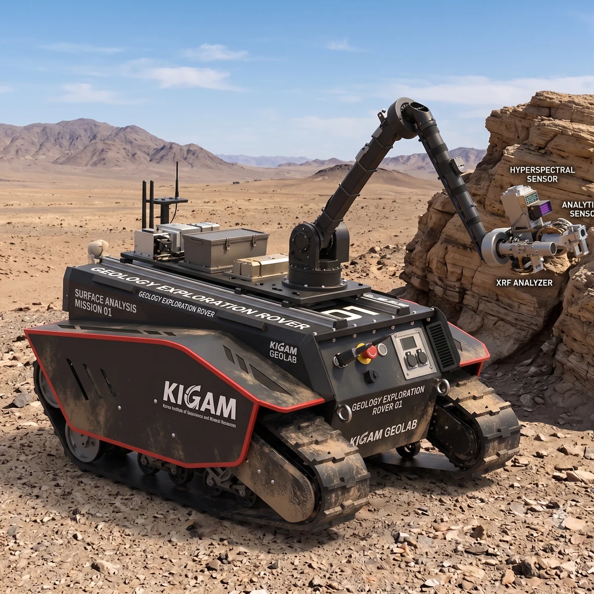

My research connects spectral measurement, three-dimensional mapping, geological interpretation, and field-ready sensing systems. I work across underground, terrestrial, satellite, and planetary observations, with an emphasis on extracting spatially meaningful geological information from hyperspectral data.

::: {.research-lightbox-loader aria-hidden="true"}
{.lightbox}
:::

:::: {.research-theme .research-theme--image-right}
::: {.research-theme__content}
## Underground Hyperspectral–LiDAR Remote Sensing

This work develops ways to acquire, align, and georeference hyperspectral observations inside mines and tunnels. The tunnel coaxial 3D hyperspectral scanning system combines line-scanning hyperspectral imagery with three-dimensional sensing to observe rock surfaces in spatial context.

**Methods:** sensor alignment, radiometric and geometric preprocessing, three-dimensional point-cloud construction, spectral mapping, and underground system integration.

[System overview](projects.qmd#tunnel-coaxial-3d-hyperspectral-scanning-system) · [2026 alignment paper](https://doi.org/10.1080/10095020.2026.2712863) · [2023 system paper](https://doi.org/10.1038/s41598-023-37565-4)
:::

::: {.research-theme__media}
<figure class="research-theme__figure">
  
  <figcaption>TCHSS exploration concept, underground data acquisition, and sensor assembly.</figcaption>
</figure>
:::
::::

:::: {.research-theme .research-theme--image-left}
::: {.research-theme__content}
## Hyperspectral Mineral Mapping

This theme covers VNIR–SWIR data processing across laboratory, ground-based, airborne, and satellite scales. Applications include alteration-mineral mapping, geological target detection, and monitoring exposed rock surfaces.

**Methods in scope:** endmember extraction, target detection, spectral unmixing, and comparison with reference spectral libraries.

An ongoing manuscript applies linear spectral unmixing with iterative error analysis to endmember extraction and mineral mapping of the lunar Theophilus Crater using Moon Mineralogy Mapper (M³) hyperspectral data.
:::

::: {.research-theme__media}
<figure class="research-theme__figure">
  
  <figcaption>Representative geological imagery and hyperspectral mineral-mapping context.</figcaption>
</figure>
:::
::::

:::: {.research-theme .research-theme--image-right}
::: {.research-theme__content}
## Planetary Geology and Remote Sensing

This theme applies orbital spectroscopy, image analysis, and three-dimensional subsurface interpretation to the Moon and Mars. Published work includes mineral mapping at the Spirit rover landing site and three-dimensional mapping of Martian lobate debris aprons. Current work on Theophilus Crater connects endmember extraction, spectral unmixing, geological mapping, and planetary remote sensing.

In parallel, ongoing rover-payload research adapts near-field hyperspectral and three-dimensional sensing for in-situ geological observation on the Moon and Mars. This work connects orbital-scale interpretation with measurements that could be acquired directly at a planetary surface.

[Rover and payload research](projects.qmd#robotic-platforms-for-near-field-geological-remote-sensing)

**Questions in scope:** what can orbital observations resolve, what requires surface measurements, and how can the two scales be connected?
:::

::: {.research-theme__media}
<figure class="research-theme__figure">
  
  <figcaption>Concept illustration linking orbital context with rover-scale spectral and LiDAR observations.</figcaption>
</figure>
:::
::::

:::: {.research-theme .research-theme--image-left}
::: {.research-theme__content}
## Robotic Near-field Geological Remote Sensing

My current research uses rovers and other robotic platforms for near-field remote sensing of underground mines and surface outcrops. The aim is to integrate hyperspectral sensors, LiDAR, positioning systems, and mobile platforms for geological observation in operationally constrained environments.

The same sensing and platform concepts are also being investigated as rover-mounted payloads for lunar and Martian exploration, linking terrestrial system development with planetary geology and in-situ remote sensing.

**Systems in scope:** rover-based sensing, ground and UAV observations, autopilot terrain following, embedded computing, three-dimensional mapping, and decision support.
:::

::: {.research-theme__media}
<figure class="research-theme__figure">
  
  <figcaption>Concept illustration of a rover-mounted near-field geological sensing platform.</figcaption>
</figure>
:::
::::
